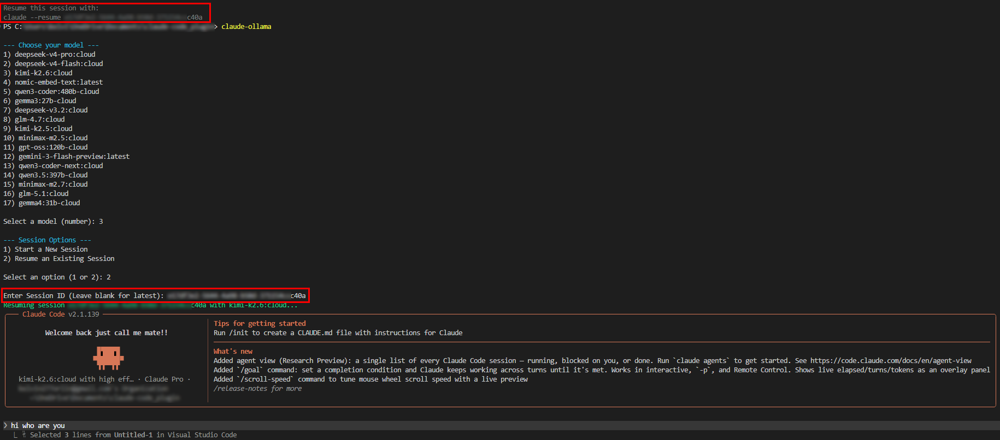
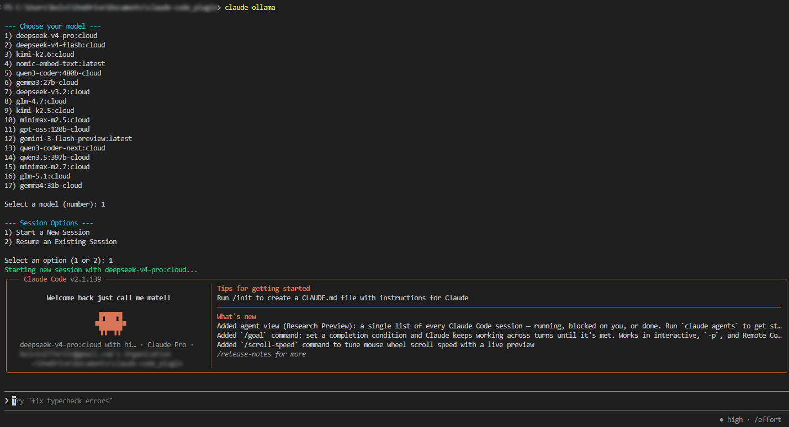

# Claude-Ollama Bridge 🌉

A lightweight, cross-platform bridge to dynamically toggle the **Claude Code CLI** between Anthropic's official hosted models and your local **Ollama** models. 

Switching Claude Code to a local model usually requires manually managing environment variables (`ANTHROPIC_BASE_URL`), memorizing model strings, and fighting with session IDs. This tool automates the entire process into a single interactive command.

## ✨ Features

- **Interactive Menus** — Automatically fetches your downloaded Ollama models and presents them in a numbered list
- **Smart Session Management** — Choose between starting a fresh local session or resuming a previous one
- **Auto-Resume** — Leave the Session ID blank to automatically pick up where you left off
- **Cross-Platform** — Native installation scripts for both Windows (PowerShell) and Unix (macOS, Linux, WSL)

---

## 📋 Prerequisites

Before installing, ensure your environment has the following:

1. **[Ollama](https://ollama.com/)** — Installed and running in the background
   ```bash
   ollama serve
   ```
   You must have at least one model pulled:
   ```bash
   ollama pull <MODEL_NAME>
   ```

2. **[Node.js](https://nodejs.org/)** — v18 or higher recommended

3. **[Claude Code](https://docs.anthropic.com/en/docs/agents-and-tools/claude-code/overview)** — Installed globally via npm

---

## 🚀 Installation

Choose the command for your operating system. These one-liners will fetch the installation script and safely inject the bridge function into your terminal's profile.

### macOS, Linux, and WSL

Run this command in your Bash or Zsh terminal:

```bash
curl -fsSL https://raw.githubusercontent.com/VinsOrl/Claude-Ollama-Bridge/refs/heads/master/install.sh | bash
```

### Windows PowerShell

Run this command in your PowerShell terminal:

```powershell
irm https://raw.githubusercontent.com/VinsOrl/Claude-Ollama-Bridge/refs/heads/master/install.ps1 | iex
```

> **Note:** If Windows blocks the script, run this first:
> ```powershell
> Set-ExecutionPolicy -ExecutionPolicy RemoteSigned -Scope CurrentUser
> ```

**After installation:** Restart your terminal or open a new tab.

---

## 📖 How to Use

### Using Official Models

To use Anthropic's official models (Sonnet/Opus), just use the standard command:
```bash
claude
```

### Using Claude-Ollama Bridge (Plugin)

Navigate or "cd" to your project folder and run:
```bash
claude-ollama
```

### The Workflow

1. **Select a Model** — The tool lists your local Ollama models. Type the number of the model you want to use
2. **Select Intent** — Choose whether to start a **New Session** (1) or **Resume** (2)
3. **Provide Session ID (Optional)** — If resuming, paste a specific Claude Code session ID (e.g., `c9bfd136...`). Leave blank to automatically resume the most recent session

### Fast Manual Resume

To resume session, you have to input the session ID, and you can find it after you quit a session like this:

```
Resume this session with:
claude --resume <YOUR_SESSION_ID>
```
If you already know the session ID, copy and paste it to the plugin:

**Option 1: Enter the Session ID**


If you want to start new session, just choose new session. It is basically the same as "ollama launch claude".

**Option 2: Choose Resume Option**



## 🗑️ Uninstallation

To remove this plugin, open your terminal profile:

**Windows:**
```powershell
notepad $PROFILE
```

**Mac/Linux:**
```bash
nano ~/.zshrc    # or
nano ~/.bashrc
```

Locate the block starting with `# --- claude-ollama start ---` and ending with `# --- claude-ollama end ---`. Delete that entire block, save the file, and restart your terminal.

---

## ⚖️ Disclaimer

This is a student-made workflow bridge. It is not an official product of Anthropic or Ollama.
